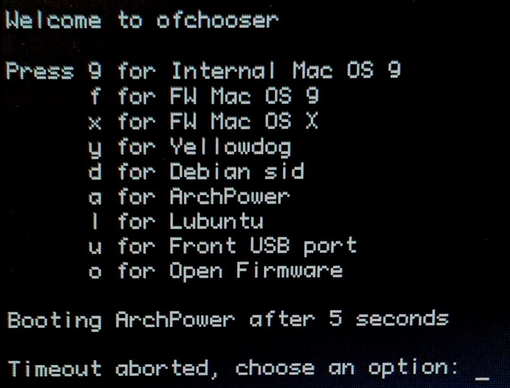

# ofchooser

Boot chooser for PowerPC Macs

## Features

Like Yaboot, allows choosing Mac OS 9, Mac OS X and Linux (and probably also other OSes).

Improvements over Yaboot's chooser:

* Every OS can have its own keyboard shortcut.
* If you need time to think, just hit any other key to stop the timeout counter.
* You can have as many installs of any kind as you want. For example, multiple OS X partitions, or multiple Linux distros.
* Uses a simple config file. Yaboot uses one complex file for both first-stage "choosing an OS" and second-stage "choosing a kernel".
* Allows USB boot.
* Can be configured and installed from either OS X or Linux.
* Falls back to other options if the default is not available, eg: if it's on a damaged partition or an external disk.

## Usage

To use ofchooser, you need to first write a config file, then build and install a boot script, and finally trigger the boot script.

### Configuration file

To use ofchooser, you'll need a small configuration file. This is just a text file, using "#" to start comments. Each line is one of:

* A loader: `k "My loader" hd:9,yaboot` configures a second-stage bootloader named "My loader", with the keyboard shortcut "k". The path to the file being loaded must be an [Open Firmware path](#open-firmware-path-tutorial). If the name has no spaces, it does not have to be quoted.
* A default selection: `default k` makes the loader with the shortcut "k" the default if the timeout passes. If no default is specificed, the first loader will be used.
* A timeout duration: `timeout 5` sets a five-second timeout, before the default booter is chosen. The default timeout is 10 seconds.

If only a single loader is specified, ofchooser will skip the chooser interface, and just straight to that loader.

See [the example configuration file](ofchooser.cfg.example).

### Building a boot script

Make sure you have Ruby installed. Any Ruby version since 1.8 should work, so even old OSes like Yellowdog Linux or Mac OS X 10.4 should be fine. You'll also need the ERB Ruby module, which is usually installed by default.

Run: `./ofchooser myconfig.cfg ofchooser.b`

This will create a boot script "ofchooser.b", which you can then install.

### Installing the boot script

There are two ways to install the boot script:

1. Just place it in an easy-to-remember place on an HFS or HFS+ partition. Eg on OS X: `sudo cp ofchooser.b /`.
2. If you have Yaboot installed, use the boot script as your "magicboot" file: `sudo ybin -m ofchooser.b -v`.
3. If you already have a partition of type "Apple_Bootstrap" for Grub or Yaboot, you can use Linux tools like `mount` and `cp` to place the boot script there.

### Triggering the boot script

Check which partition number your boot script is installed on.

Then on reboot, hold down Command-Option-O-F to enter Open Firmware. Use the `boot` command to trigger ofchooser. If it's on partition 9 of your internal hard disk: `boot hd:9,ofchooser.b`. You should now enter the chooser.

If you're happy with ofchooser, and want your computer to use it by default, set it as the boot device. Some ways to do this:

1. In Open Firmware: `setenv boot-device=hd:9,ofchooser.b`
2. In OS X: `sudo nvram boot-device=hd:9,ofchooser.b`
3. In modern Linux: `sudo nvram --update-config boot-device=hd:9,ofchooser.b`

## Open Firmware path tutorial

Open Firmware paths look weird, so here's a tutorial

Each boot file's path looks like `[device]:[partition],[path]`.

The device part can be a full Open Firmware device, which tends to look pretty complicated, eg: `/pci@f2000000/usb@18/disk`. In Open Firmware, you can list all full devices with `dev / ls`.

The device part can also be a short Open Firmware alias, such as `hd` for the internal hard drive. In Open Firmware, you can type `devalias` to see a list of all existing aliases, or `nvalias myalias /full/ofpath` to create a new custom alias.

The partition part is just a number indicating the partition on which the boot file lives. Note that Apple partitions often have unexpected numbers due to hidden partitions. Use `blkid` on Linux, or `diskutil list` on Mac OS X to see all your partitions and their actual numbers.

The path part is a directory-and-file path to the boot file. The path uses backslashes (`\`) as directory separators. You can omit the first separator, so a path in the root directory can be just `ofchooser.b`. Or a longer path could be `ppc\grub\grub`. There's also a special path `\\:tbxi` that chooses whatever boot file HFS/HFS+ considers "blessed", and is usually the easiest way to choose the Mac OS 9 or Mac OS X loader.

To make sure you have a path correct, you can use the `dir` command in Open Firmware. Eg: `dir hd:9,\` will list the root directory of the given path.

Finally, as an extension, ofchooser treats the path "OF" as a special value, which exits from ofchooser back into Open Firmware.

## Caveats

* ofchooser is just a first-stage boot-chooser. You still need a second-stage bootleader like Yaboot or Grub to boot Linux.
* Only tested on a single iBook Dual USB.

## License

ⓒ 2025 Dave Vasilevsky

Licensed under the GPL version 2 (or later), see [COPYING](COPYING).

Derived from [Yaboot](https://github.com/yaboot/yaboot).